# DYNAMIC - PreTESTING Database ERD

This ERD documents the current backend database shape defined in `apps/api/src/db/schema/` and the generated Drizzle migrations. It follows the approved architecture rule that SurveyJS responses are immutable evidence, while longitudinal operational state lives in normalized domain tables.

## Core ERD

```mermaid
erDiagram
  study_sites {
    integer site_id PK
    text site_code
    text site_name
  }

  study_localities {
    integer site_id PK
    text locality_code PK
    text locality_name
    text locality_type
  }

  mapping_frame {
    text household_id PK
    integer site_id
    text locality_code
    text structure_map_id
    text household_number
    text structure_id
    text mapping_status
    text baseline_enrollment_status
  }

  households {
    text household_id PK
    integer site_id
    text locality_code
    text structure_map_id
    text household_number
    text baseline_enrollment_status
    date baseline_completed_date
    text cohort_status
    text closed_reason
  }

  household_members {
    text household_member_id PK
    text household_id FK
    integer member_number
    integer site_id
    text locality_code
    text name
    integer sex
    date date_of_birth
    text member_status
    boolean usual_resident
  }

  eligible_women {
    text woman_id PK
    text household_member_id FK
    text household_id FK
    integer site_id
    text locality_code
    date eligibility_start_date
    text wq_status
    text tracking_status
    text current_eligibility_status
  }

  eligibility_assessments {
    text assessment_id PK
    text person_id
    text household_id
    date assessment_date
    boolean eligible_wq
    boolean eligible_pregnancy_tracking
    text created_event_id
  }

  pregnancies {
    text pregnancy_id PK
    text woman_id FK
    text household_member_id
    text household_id
    integer site_id
    text locality_code
    integer pregnancy_sequence
    text pregnancy_status
    date detected_date
    date enrollment_date
    date outcome_recorded_date
  }

  ultrasound_records {
    text ultrasound_id PK
    text pregnancy_id FK
    text woman_id
    text household_id
    integer site_id
    date report_date
    integer report_sequence
  }

  pregnancy_outcomes {
    text pregnancy_outcome_id PK
    text pregnancy_id FK
    date outcome_date
    text outcome_type
    integer live_birth_count
    integer fetal_loss_count
    text source_form_response_id
  }

  children {
    text child_id PK
    text birth_id
    text pregnancy_id FK
    text woman_id
    text household_id
    integer site_id
    integer birth_rank
    date birth_date
    text birth_status
    text current_vital_status
    date death_date
  }

  visits {
    text visit_id PK
    text session_id
    integer site_id
    text locality_code
    text household_id
    text primary_subject_type
    text primary_subject_id
    text interviewer_id
    text device_id
  }

  form_responses {
    text form_response_id PK
    text response_id UK
    integer site_id
    text locality_code
    text household_id
    text visit_id FK
    text task_id
    text form_code
    text form_version
    text subject_type
    text subject_id
    jsonb answers_json
    text response_status
  }

  domain_events {
    text event_id PK
    text event_type
    integer site_id
    text locality_code
    text household_id
    text subject_type
    text subject_id
    text visit_id
    text task_id
    text form_response_id
    text sync_status
    text apply_status
  }

  follow_up_tasks {
    text task_id PK
    text task_key UK
    integer site_id
    text locality_code
    text household_id
    text subject_type
    text subject_id
    text woman_id
    text pregnancy_id
    text child_id
    text task_type
    text form_code
    date target_date
    text status
    text form_availability
    text action_state
  }

  task_attempts {
    text attempt_id PK
    text task_id
    integer attempt_number
    text visit_id
    timestamp attempted_at
    text attempted_by_user_id
    text device_id
    text outcome
    text reason_code
  }

  users {
    text user_id PK
    text username UK
    text display_name
    text email
    text role
    integer site_id
    boolean active
  }

  devices {
    text device_id PK
    text device_name
    text user_id FK
    timestamp last_sync_at
    timestamp registered_at
  }

  user_area_assignments {
    text assignment_id PK
    text user_id FK
    integer site_id
    text locality_code
    text role
    date active_from
    date active_to
  }

  sync_logs {
    text sync_log_id PK
    text device_id
    text user_id
    text direction
    integer records_sent
    integer records_received
    integer conflicts_detected
    text status
  }

  admin_correction_events {
    text correction_event_id PK
    integer site_id
    text subject_type
    text subject_id
    text field_name
    text old_value
    text new_value
    text corrected_by_user_id
    timestamp corrected_at
  }

  admin_corrections {
    text id PK
    text entity_type
    text entity_id
    text field
    text old_value
    text new_value
    text corrected_by
    timestamp corrected_at
  }

  data_quality_flags {
    text flag_id PK
    integer site_id
    text flag_type
    text subject_type
    text subject_id
    text task_id
    text primary_response_id
    text duplicate_response_id
    text severity
    text status
  }

  person_attribute_history {
    text history_id PK
    text person_id
    text field_name
    text old_value
    text new_value
    text source_form_response_id
    text source_event_id
    timestamp changed_at
  }

  study_sites ||--o{ study_localities : contains
  study_sites ||--o{ mapping_frame : scopes
  study_localities ||--o{ mapping_frame : lists
  mapping_frame ||--o| households : enrolls_as

  study_sites ||--o{ households : scopes
  study_localities ||--o{ households : scopes
  households ||--o{ household_members : has
  households ||--o{ eligible_women : contains
  household_members ||--o| eligible_women : may_become
  household_members ||--o{ eligibility_assessments : assessed_as

  eligible_women ||--o{ pregnancies : has
  pregnancies ||--o{ ultrasound_records : has
  pregnancies ||--o{ pregnancy_outcomes : ends_with
  pregnancies ||--o{ children : creates_followup_for

  households ||--o{ visits : has
  visits ||--o{ form_responses : captures
  households ||--o{ form_responses : evidence_for

  form_responses ||--o{ domain_events : emits
  visits ||--o{ domain_events : emits
  follow_up_tasks ||--o{ domain_events : changes

  follow_up_tasks ||--o{ task_attempts : records
  follow_up_tasks ||--o{ form_responses : completed_by
  visits ||--o{ task_attempts : includes

  users ||--o{ devices : owns
  users ||--o{ user_area_assignments : assigned_to
  devices ||--o{ sync_logs : reports
  users ||--o{ sync_logs : performs

  users ||--o{ admin_correction_events : makes
  users ||--o{ admin_corrections : makes
  form_responses ||--o{ data_quality_flags : may_flag_duplicate
  follow_up_tasks ||--o{ data_quality_flags : may_flag
  form_responses ||--o{ person_attribute_history : sources
  domain_events ||--o{ person_attribute_history : sources
```

## Table Inventory

| Area | Tables | Purpose |
| --- | --- | --- |
| Masters and mapping | `study_sites`, `study_localities`, `mapping_frame` | Site/locality scope and mapped household frame before baseline enrollment. |
| Household roster | `households`, `household_members`, `eligibility_assessments` | Enrolled household state, durable member identity, and eligibility calculation evidence. |
| Woman and pregnancy tracking | `eligible_women`, `pregnancies`, `ultrasound_records` | Eligible woman state, pregnancy episodes, and ultrasound records. |
| Outcomes and child follow-up | `pregnancy_outcomes`, `children` | Pregnancy outcome evidence and child/newborn follow-up records. `birth_id` is currently the child link to birth/outcome identity. |
| Fieldwork evidence | `visits`, `form_responses`, `domain_events` | Visit sessions, immutable SurveyJS answers, and domain events extracted from submitted evidence. |
| Work management | `follow_up_tasks`, `task_attempts` | Scheduled/contextual worklist tasks and failed/completed contact attempts. |
| Users and sync | `users`, `devices`, `user_area_assignments`, `sync_logs` | Role/site users, device registration, locality assignment, and sync monitoring. |
| Corrections and quality | `admin_correction_events`, `admin_corrections`, `data_quality_flags`, `person_attribute_history` | Audited admin corrections, duplicate/conflict flags, and person attribute change history. |

## Relationship Notes

- Only some relationships are currently enforced as database foreign keys in Drizzle. The ERD also shows intended operational relationships carried by ID fields such as `site_id`, `locality_code`, `household_id`, `task_id`, `subject_type`, and `subject_id`.
- `subject_type` plus `subject_id` is a polymorphic link used by tasks, events, form responses, corrections, and data-quality flags. It can point at household, member/person, woman, pregnancy, child, or other protocol subjects depending on the row.
- `form_responses.answers_json` stores immutable SurveyJS answers. Derived operational state belongs in the normalized tables rather than in the SurveyJS JSON.
- `admin_correction_events` is the newer subject-based audit table. `admin_corrections` is also present in the current migration set for the earlier household/member correction route.
- The concept document now uses `birth_outcome_id` as the permanent per-outcome identity. The current implemented table is `pregnancy_outcomes` with `pregnancy_outcome_id`; `children.birth_id` carries the child-side birth/outcome link and may need alignment if the physical schema is renamed later.
