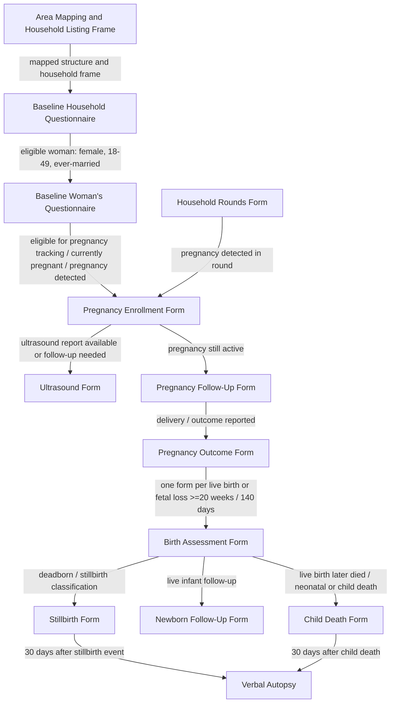

# DYNAMIC Questionnaire Flow

Working flow document for the offline data-capture application. This describes which questionnaire opens when, which entity IDs connect forms, and which values are calculated within and across questionnaires.

## Basic Survey Rules

| Rule | Meaning for the app |
| --- | --- |
| Planned household survey start | Baseline household survey is planned to start on 1 September 2026. Treat this as an operational planning date, not a form version date. |
| Enrollment period | Planned enrollment period is 2.5 years from household survey start: 1 September 2026 to 28 February 2029. |
| Outcome follow-up period | After enrollment closes, continue follow-up of all outcomes for 1.5 years: 1 March 2029 to 31 August 2030. |
| Total planned field period | 4 years total: 1 September 2026 to 31 August 2030. |
| Closed household cohort | The set of households is fixed after baseline enumeration. |
| No new households | Household Rounds must only operate on households created in the Baseline Household Questionnaire. The app should not allow creation of a new household after baseline closure. |
| Baseline HH enrollment required | Future visits to a household are allowed only if the household completed/entered Baseline Household enrollment. A mapped household without baseline enrollment is not part of the longitudinal cohort. |
| Empty at baseline stays out | If a mapped structure/household is empty, vacant, or not occupied at baseline, it remains outside follow-up even if occupied later. Do not open Household Rounds or downstream forms for later occupants. |
| Household split keeps original household number | If an enrolled household splits during follow-up, do not create a new household number. Continue using the original `household_id`/household number. Do not create a split event. Field staff may document context in household or individual notes only. |
| New household members within existing households | Household Rounds may add new members to an already-enrolled household when there is in-migration, birth, or marriage-in, as allowed by protocol. |
| New women through household change | Women may enter the eligible cohort if they are added to an existing household through in-migration or marriage-in and meet eligibility criteria. |
| Temporary pregnancy/delivery visitors excluded | Women temporarily coming to a natal/maternal household for pregnancy care, delivery, postpartum stay, or similar visit are not eligible cohort women for that household. The current PDFs do not provide a general temporary-visit capture module, so do not add them to the household roster or open Woman questionnaire/pregnancy tracking from that household. |
| Follow existing cohort | Household Rounds, Pregnancy Enrollment, Follow-Up, Outcome, Birth Assessment, Stillbirth, Newborn Follow-Up, and Child Death forms must link back to existing baseline household/member/woman IDs. |
| Corrections only with audit | If a baseline household member was entered incorrectly, changes should be handled as correction/edit with audit trail, not as a new cohort member. |
| Additions require event trail | New members added after baseline must store reason for addition, date detected, source round/visit, and whether they became eligible for the Woman questionnaire. Pregnancy tracking eligibility is determined from the Woman questionnaire and subsequent pregnancy detection workflow. |

## Individual Movement

Individual movement must be documented during Household Rounds for enrolled baseline households.

| Movement type | Meaning | Cohort implication |
| --- | --- | --- |
| In-migration | Person becomes a usual resident of an enrolled household after baseline | Add household member row/event; recalculate eligibility |
| Marriage-in | Woman/person joins an enrolled household through marriage | Add household member row/event; recalculate Woman questionnaire eligibility; pregnancy tracking is determined after Woman questionnaire/pregnancy detection workflow |
| Birth into household | New child born to cohort woman/household | Add child/birth-linked member as required by protocol |
| Out-migration | Existing household member leaves and is no longer a usual resident | Keep original member ID; mark movement out with date/reason |
| Marriage-out | Existing woman/person leaves household through marriage | Keep original member ID; mark movement out; stop household-based follow-up unless protocol says otherwise |
| Death | Existing household member dies | Keep original member ID; mark death event; route to relevant death form if applicable |
| Temporary visit | Person is present but not a usual resident | Not captured as a household member in the current PDFs |
| Pregnancy/delivery visit to natal household | Woman temporarily comes for pregnancy care, delivery, postpartum stay | Exclude from Woman questionnaire and pregnancy tracking for that household; do not add to roster |

Movement event fields:

| Field | Purpose |
| --- | --- |
| `movement_event_id` | unique event ID |
| `household_id` | enrolled household |
| `household_member_id` | existing or newly created member ID |
| `movement_type` | in-migration / out-migration / marriage-in / marriage-out / birth / death / temporary visit |
| `movement_date` | date movement occurred or was first reported |
| `detected_visit_id` | Household Round visit where movement was detected |
| `reason` | coded reason |
| `usual_resident_status` | usual resident / moved out / died; no general temporary-visitor capture in current PDFs |
| `eligibility_recalculated` | yes/no |

Rules:

| Rule | App behavior |
| --- | --- |
| New member in existing enrolled household | create new `household_member_id` and movement event |
| Existing member leaves | do not delete row; mark inactive/not usual resident from movement date |
| Temporary visitor | do not add to roster under current PDFs; do not trigger Woman questionnaire or pregnancy tracking |
| Re-entry | if same person returns, reuse original `household_member_id` where identity is certain; otherwise flag for review |
| Eligibility changes | recalculate eligibility after every movement event |
| Household split | retain original `household_id`; do not create a new HH number; do not create an event; use non-analytic household/individual notes if field context is needed |

## Notes Fields

Household-level and individual-level notes are for field context only.

| Notes field | Use | Analysis role |
| --- | --- | --- |
| Household notes | Free-text field staff notes about household context, including household split context if needed | Not used for analysis |
| Individual notes | Free-text field staff notes about a person/member context | Not used for analysis |

Rules:

| Rule | App behavior |
| --- | --- |
| Notes are optional | Do not require notes for form completion |
| Notes are non-analytic | Do not use notes for skip logic, eligibility, cohort definition, or statistical analysis |
| Notes are audit/context only | Store with visit metadata for field review and supervision |
| Household split | Mention in notes if needed; do not create a household split event or new household ID |

## Core Entities and IDs

| Entity | Primary ID | Parent ID | Created in | Used by |
| --- | --- | --- | --- | --- |
| Household | `household_id` | Site/locality/structure | Baseline Household Questionnaire | All household-linked forms |
| Household member | `household_member_id` | `household_id` | Baseline Household listing | Woman questionnaire; pregnancy tracking after WQ/HRF pregnancy detection |
| Woman | `woman_id` | `household_member_id` | Woman eligibility from HH listing | Woman questionnaire, pregnancy forms |
| Pregnancy | `pregnancy_id` | `woman_id` | Pregnancy Enrollment | Ultrasound, follow-up, outcome |
| Birth / fetus / infant | `birth_id` | `pregnancy_id` | Pregnancy Outcome / Birth Assessment | Birth assessment, stillbirth, newborn follow-up, child death |
| Visit | `visit_id` | Household/woman/pregnancy/infant as applicable | App visit/session layer | Audit trail and repeat rounds |
| Event | `event_id` | Relevant entity | App event layer | Pregnancy detection, ultrasound, delivery, death, follow-up |

## Recommended ID Composition

Use stable semantic IDs in the app even if the PDF variable labels are shorter.

| ID | Suggested construction |
| --- | --- |
| `household_id` | `site_id + locality_code + structure_map_id + household_number` |
| `household_member_id` | `household_id + member_line_number` |
| `woman_id` | `household_member_id` for eligible woman, plus permanent ID if generated |
| `pregnancy_id` | `woman_id + pregnancy_rank_since_baseline` or generated permanent pregnancy UUID |
| `birth_id` | `pregnancy_id + birth_rank` |
| `visit_id` | UUID generated for each form-opening/interview session |
| `event_id` | UUID generated for each domain event |

Unresolved: confirm whether permanent IDs should be deterministic from hierarchy or randomly generated and stored once.

## High-Level Questionnaire Order

The authoritative forms summary table is `Refs/pretsing forms/forms_summary table_v2026.05.17.pdf`. The table defines form order, respondent, timing, mode, purpose, and downstream flow. Use it with the detailed PDFs when implementing app routing.

| No. | Code | Form | Respondent | Timing | Mode | Main purpose | Downstream flow |
| --- | --- | --- | --- | --- | --- | --- | --- |
| 1 | HHQ | Baseline Household Questionnaire | Any adult able to provide information | Baseline | Face-to-face | Household listing and baseline household characteristics | WQ for ever-married women aged 18-49; HRF for households without eligible women |
| 2 | WQ | Baseline Woman's Questionnaire | Ever-married women aged 18-49 | Baseline | Face-to-face | Baseline woman's characteristics and retrospective pregnancy histories | PEF for women pregnant at baseline; HRF for eligible women |
| 3 | HRF | Household Rounds Form | Eligible women; any adults for households without eligible women | Bi-monthly | Telephonic | Detect new pregnancies; identify new eligible women | PEF for pregnant woman; WQ for new eligible women |
| 4 | PEF | Pregnancy Enrollment Form | Mother | Once new pregnancy is detected | Face-to-face | Baseline pregnancy information | UF when first ultrasound is completed; PFF |
| 5 | UF | Ultrasound Form | Mother provides USG report | Once first USG has been performed | Extracted from USG report | USG-based gestational age | None |
| 6 | PFF | Pregnancy Follow-Up Form | Mother | Monthly | Alternate face-to-face and telephonic | Pregnancy progress and other maternal variables | UF when first ultrasound is completed; POF once pregnancy completed |
| 7 | POF | Pregnancy Outcome Form | Mother | Day of delivery or day after | Face-to-face | Conditions of delivery and outcome | BAF for each birth >=20 weeks |
| 8 | BAF | Birth Assessment Form | Mother | Same time as POF | Face-to-face | Information for each birth >=20 weeks | SBF or CDF if died by visit; NFF if survived |
| 9 | SBF | Stillbirth Form | Mother | Same time as BAF | Face-to-face | Stillbirth-specific information | VA |
| 10 | NFF | Newborn Follow-Up Form | Mother | 7d, 28d, 2m, 3m, 4.5m, 6m, 7.5m, 9m, 10.5m, 12m, 14m, 16m... until end of study | Face-to-face at 7d, 28d, 2m, 3m, 6m, 9m, 12m; telephonic for all other visits | Child survival status and child variables | Subsequent NFF if survived; CDF if died |
| 11 | CDF | Child Death Form | Mother | Same time as BAF or NFF | Face-to-face | Child-death-specific information | VA |
| 12 | VA | Verbal Autopsy | Mother | 30 days after stillbirth or child death | Face-to-face | Verify stillbirth vs neonatal deaths and obtain cause-of-death information | None |

Combination notes from summary table:

| Form | May be combined with |
| --- | --- |
| HRF | PFF and/or NFF when relevant |
| PFF | HRF and/or NFF when relevant |
| NFF | HRF and/or PFF when relevant |

Summary-table footnote:

```text
Eligible women = women at risk of becoming pregnant during the study period.
```



## Baseline Household Questionnaire

Purpose: create the household, complete the household listing, populate household total counts, and derive Woman questionnaire eligibility flags.

Baseline Household Questionnaire is conducted from a pre-created site mapping/listing frame. Before HHQ, each site draws/maps the study area and lists all structures/households in that area. HHQ should select from or validate against this mapped frame, not create arbitrary new households.

The household listing is the source of the household totals used inside HHQ. In the app, HHQ keeps total persons and total women eligible for the Woman's Questionnaire as auto-filled fields. The total potentially eligible for pregnancy tracking is not shown in HHQ; pregnancy tracking eligibility flows from the Woman's Questionnaire and subsequent pregnancy detection workflow.

Flowchart interpretation:

| Household listing result | Next step |
| --- | --- |
| Ever-married woman aged 18-49 found | Open Baseline Woman's Questionnaire for each eligible woman |
| Household without Woman-questionnaire eligible woman | Enter Household Rounds workflow for roster updates and pregnancy detection as per protocol |
| New eligible woman found during Household Rounds | Open Baseline Woman's Questionnaire |
| Pregnancy detected during Woman's Questionnaire or Household Rounds | Open Pregnancy Enrollment |

Key fields:

| Field | Role |
| --- | --- |
| `hhq_site_id` | Site component of household ID |
| `hhq_locality_code` | Locality component of household ID |
| `hhq_structure_map_id` | 4-digit structure component |
| `hhq_household_number` | 2-digit household component |
| `hhq_contact_mobile` | 10-digit contact phone |
| `hhq_household_members` | Dynamic household member listing |
| `hhq_total_household_members` | Auto-filled count from listing, range 1-20 |
| `hhq_total_eligible_women` | Auto-filled count: female, age 18-49, ever-married |

Household listing row fields:

| Field | Use |
| --- | --- |
| `member_line_number` | Member row number; part of `household_member_id` |
| `member_name` | Display name |
| `member_relationship_to_head` | Relationship coding |
| `member_sex` | Eligibility input |
| `member_age_years` | Eligibility input |
| `member_marital_status` | Eligibility input |
| `member_woman_questionnaire_eligible` | Auto-filled per member |

Within-questionnaire calculations:

| Calculated field | Rule |
| --- | --- |
| `hhq_total_household_members` | Count rows in `hhq_household_members` |
| `member_woman_questionnaire_eligible` | `member_sex = female` AND `18 <= member_age_years <= 49` AND `member_marital_status != never married` |
| `hhq_total_eligible_women` | Count member rows where `member_woman_questionnaire_eligible = yes` |

Unresolved: confirm whether widowed/divorced/separated/deserted count as ever-married for WQ eligibility. Current assumption: yes, all marital status codes except never married count as ever-married.

Important exclusion: do not count a woman as eligible if she is only a temporary visitor to her natal/maternal household for pregnancy, delivery, postpartum stay, or similar reason. The current PDFs do not capture a general temporary-visitor record, so she should not be added to the household roster and must not generate Woman questionnaire or pregnancy tracking eligibility.

## Baseline Woman's Questionnaire

Purpose: respondent background, reproductive history, current pregnancy status, and determination of whether the woman enters pregnancy tracking.

Opens for each HH member where:

```text
member_woman_questionnaire_eligible = yes
```

Links:

| From HHQ | To WQ |
| --- | --- |
| `household_id` | `household_id` |
| `household_member_id` | `woman_id` / `household_member_id` |
| woman name | display/autofill |
| husband name, if available | display/autofill |

Key within-form calculations:

| Field | Rule |
| --- | --- |
| Total live births | sons at home + daughters at home + sons elsewhere + daughters elsewhere + boys dead + girls dead |
| Total pregnancy outcomes | total live births + pregnancy losses |
| Pregnancy history rows | one row per pregnancy outcome, twins/triplets on separate lines where specified |
| Current pregnancy status | drives Pregnancy Enrollment |

Inter-form trigger:

| Condition | Opens |
| --- | --- |
| currently pregnant / pregnancy detected | Pregnancy Enrollment |
| eligible for pregnancy tracking | Household Rounds and pregnancy follow-up workflows, determined after Woman questionnaire |

Unresolved: exact field names and skip expressions for all WQ pregnancy-history rows still need final question-by-question verification.

## Household Rounds Form

Purpose: repeated household/woman surveillance after baseline.

Opens for households/women under pregnancy tracking.

Operational order during household visit:

| Step | Action | Reason |
| --- | --- | --- |
| 1 | Update household roster and member status | Household member/person IDs must be current before any downstream event is created |
| 2 | Recalculate woman and pregnancy-tracking eligibility | New eligible women may appear through valid in-migration, marriage-in, or age/status changes |
| 3 | Detect pregnancies | Pregnancy detection must be linked to an eligible woman/person ID |
| 4 | Open Pregnancy Enrollment if pregnancy detected | Pregnancy entry requires `household_member_id` / `woman_id` |

If both roster change and pregnancy are detected in the same visit, update the roster first, create or confirm the woman's ID, then add the pregnancy event/enrollment.

Exception: if an interval pregnancy is detected for an already-enrolled/identified woman who already has a valid `household_member_id` / `woman_id`, Pregnancy Enrollment Form can be opened directly. A roster update is only required first when the woman/person ID does not yet exist or her household membership/status must be corrected.

Main triggers:

| Condition | Action |
| --- | --- |
| New or suspected pregnancy found | Open Pregnancy Enrollment |
| Existing pregnancy still active | Continue follow-up |
| Pregnancy outcome reported | Open Pregnancy Outcome |

Unresolved: round frequency and whether HRF is household-level first or woman-level first.

## Pregnancy Enrollment Form

Purpose: create a pregnancy record.

Opens from:

| Source | Trigger |
| --- | --- |
| WQ | pregnancy detected in baseline Woman questionnaire |
| HRF | pregnancy detected in household round |
| Community health worker / ASHA | external pregnancy information |
| Register | external pregnancy information |

Key IDs:

| Field | Role |
| --- | --- |
| `woman_id` | parent |
| `pregnancy_rank_since_baseline` | pregnancy sequence |
| `pregnancy_id` | pregnancy record ID |

Key inter-form triggers:

| Condition | Opens |
| --- | --- |
| first ultrasound report available | Open Ultrasound Form; upload happens in UF variable 21 |
| ultrasound not done/report missing | follow-up task/event |
| active pregnancy | Pregnancy Follow-Up |
| pregnancy outcome reported | Pregnancy Outcome |

Within-form notes:

| Topic | Rule |
| --- | --- |
| UPT confirmation | site-specific for Bareilly; other sites may skip as per PDF |
| LMP | date or relative duration/special code |
| Facility list | site-specific list; keep as configurable lookup, not hard-coded PDF placeholder |
| USG report availability | PEF questions 12-16 determine whether ultrasound report(s) exist and whether UF should be opened. The actual upload field is in Ultrasound Form variable 21. |

Unresolved: final top-10 facility lists per site.

## Ultrasound Form

Purpose: capture ultrasound report and gestational age.

Opens when:

```text
pregnancy has ultrasound report available OR ultrasound follow-up is due
```

Links:

| Parent | Child |
| --- | --- |
| `pregnancy_id` | ultrasound record |

Upload location from PDF:

| UF Variable ID | Question |
| --- | --- |
| `21` | Upload Photo / PDF of the USG report |

Feeds:

| Ultrasound field | Used by |
| --- | --- |
| gestational age | Pregnancy Outcome gestational-age calculations |
| report availability | Pregnancy Enrollment eligibility/follow-up state |

Unresolved: whether multiple ultrasound reports are separate records or repeated panels inside one ultrasound form.

## Pregnancy Follow-Up Form

Purpose: monitor active pregnancy until outcome.

Opens when:

```text
pregnancy_id exists AND pregnancy outcome not yet recorded
```

Triggers:

| Condition | Action |
| --- | --- |
| pregnancy still ongoing | schedule next follow-up |
| delivery/outcome reported | open Pregnancy Outcome |
| ultrasound/report newly available | open Ultrasound Form |

Unresolved: follow-up schedule and event dates.

## Pregnancy Outcome Form

Purpose: close pregnancy episode and create birth/fetal-loss records.

Opens when:

```text
delivery, miscarriage, stillbirth, abortion, or other pregnancy outcome is reported
```

Key outputs:

| Field | Creates |
| --- | --- |
| number of live born infants | one Birth Assessment per live born infant |
| number of miscarriages/stillbirths | Birth Assessment if GA >=20 weeks / 140 days |
| outcome type | outcome event and downstream form routing |

Inter-form triggers:

| Condition | Opens |
| --- | --- |
| live born infant | Birth Assessment |
| miscarriage/stillbirth with GA >=20 weeks / 140 days | Birth Assessment |
| induced abortion | stop downstream birth assessment unless protocol says otherwise |

Unresolved: whether miscarriage <20 weeks has a separate minimal event record only.

## Birth Assessment Form

Purpose: assess each live birth or qualifying fetal loss.

Opens once per:

```text
birth_id generated from Pregnancy Outcome
```

Key classification:

| Inputs | Classification |
| --- | --- |
| Q16-Q20 signs of life | live birth vs deadborn |
| Q21 clinical determination | stillbirth vs neonatal death |
| vital status at interview | live follow-up vs death form |

Inter-form triggers:

| Condition | Opens |
| --- | --- |
| stillbirth classification | Stillbirth Form |
| live infant | Newborn Follow-Up Form |
| neonatal/child death | Child Death Form |

Unresolved: whether Q21 overrides Q16-Q20 or is only a confirmation field.

## Stillbirth Form

Purpose: detailed stillbirth assessment.

Opens when Birth Assessment classifies the birth/fetus as stillbirth.

Links:

| Parent | Child |
| --- | --- |
| `birth_id` | stillbirth record |
| `pregnancy_id` | pregnancy outcome context |

Unresolved: final trigger rule using Q16-Q21 needs review against Stillbirth PDF.

Verbal autopsy trigger:

| Condition | Action |
| --- | --- |
| Stillbirth recorded | Schedule verbal autopsy 30 days after the stillbirth/death event |
| 30 days elapsed | Open Verbal Autopsy workflow/form |

## Newborn Follow-Up Form

Purpose: follow live infants after birth.

Opens when:

```text
birth_id is live infant AND child is alive at Birth Assessment or follow-up due
```

Schedule from forms summary table:

| Visit timing | Mode |
| --- | --- |
| 7 days | Face-to-face |
| 28 days | Face-to-face |
| 2 months | Face-to-face |
| 3 months | Face-to-face |
| 4.5 months | Telephonic |
| 6 months | Face-to-face |
| 7.5 months | Telephonic |
| 9 months | Face-to-face |
| 10.5 months | Telephonic |
| 12 months | Face-to-face |
| 14 months, 16 months, and later scheduled visits until end of study | Telephonic unless protocol specifies face-to-face |

Links:

| Parent | Child |
| --- | --- |
| `birth_id` | newborn follow-up visit |

Triggers:

| Condition | Action |
| --- | --- |
| child alive | continue follow-up schedule |
| child died | open Child Death Form |

Unresolved: exact schedule after 16 months until end of study.

## Child Death Form

Purpose: record infant/child death after signs of life.

Opens when:

```text
birth_id had signs of life AND death is reported
```

Links:

| Parent | Child |
| --- | --- |
| `birth_id` | child death record |
| `pregnancy_id` | pregnancy context |
| `woman_id` | mother context |

Unresolved: boundary between neonatal death and later child death labels in app navigation.

Verbal autopsy trigger:

| Condition | Action |
| --- | --- |
| Child death recorded | Schedule verbal autopsy 30 days after death |
| 30 days elapsed | Open Verbal Autopsy workflow/form |

## Verbal Autopsy

Purpose: record cause-of-death information after the required waiting period.

Opens when:

```text
stillbirth event OR child death event is recorded
AND 30 days have elapsed since the death/event date
```

Mode: face-to-face.

Main purpose: verify stillbirth vs neonatal deaths and obtain cause-of-death information.

Links:

| Parent event | VA parent ID |
| --- | --- |
| Stillbirth | `birth_id` / stillbirth record |
| Child death | `birth_id` / child death record |

Unresolved: VA form source and final questionnaire format.

## Event Model

The app should create events separately from forms so the same pregnancy or infant can be followed offline.

Suggested event types:

| Event type | Entity |
| --- | --- |
| `household_created` | Household |
| `household_listing_completed` | Household |
| `woman_eligible` | Woman |
| `pregnancy_detected` | Woman/Pregnancy |
| `pregnancy_enrolled` | Pregnancy |
| `ultrasound_reported` | Pregnancy |
| `pregnancy_followup_completed` | Pregnancy |
| `pregnancy_outcome_recorded` | Pregnancy |
| `birth_assessment_completed` | Birth |
| `stillbirth_recorded` | Birth |
| `newborn_followup_completed` | Birth |
| `child_death_recorded` | Birth |
| `verbal_autopsy_due` | Birth/death event |
| `verbal_autopsy_completed` | Birth/death event |

Each event should store:

| Field | Purpose |
| --- | --- |
| `event_id` | event primary key |
| `event_type` | type above |
| `entity_type` | household / woman / pregnancy / birth |
| `entity_id` | linked entity |
| `visit_id` | interview/session |
| `event_datetime` | local event time |
| `created_offline_at` | app capture time |
| `synced_at` | sync audit |

## App Implementation Notes

| Need | Implementation direction |
| --- | --- |
| Offline rendering | SurveyJS JSON bundled locally |
| On-the-fly translation | SurveyJS locale plus localized `title`, `description`, and `choices.text` |
| Calculations | SurveyJS calculated values or app-side event handlers |
| Cross-form opening | app router/state machine using entity IDs and form completion events |
| Configurable site options | keep facility lists and locality lists as site-specific lookup tables |
| Audit | store form version, form ID, visit ID, and event ID with every saved response |

## Review Items

1. Confirm permanent ID generation strategy: deterministic hierarchy vs random generated IDs.
2. Confirm WQ ever-married eligibility: all non-never-married statuses?
3. Confirm currently married definition for pregnancy tracking: codes 1, 2, and 8?
4. Confirm facility lists per site for Pregnancy Enrollment Q20/Q22.
5. Confirm ultrasound multiplicity: repeated ultrasound records or one form with repeated report panels.
6. Confirm Pregnancy Outcome handling for miscarriage under 20 weeks.
7. Confirm whether Birth Assessment Q21 overrides Q16-Q20 for stillbirth/neonatal-death classification.
8. Confirm newborn follow-up schedule and end condition.
